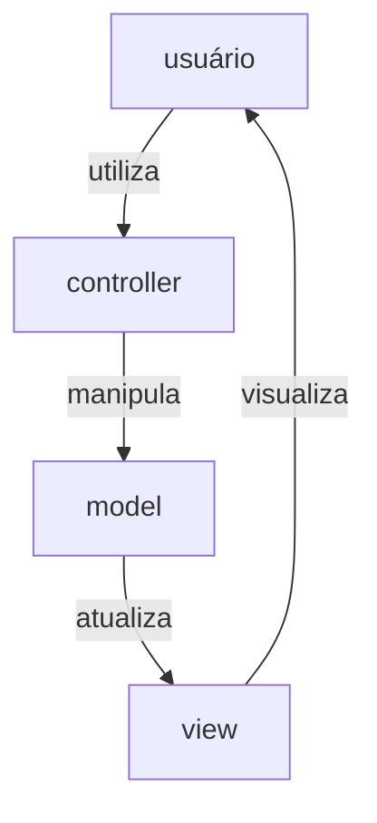

# pythonFlask

## Sumário

<!-- TOC -->
* [Introdução](#introdução)
* [Instalação](#instalação)
* [Índice de termos](#índice-de-termos)
* [Estrutura de um projeto Flask](#estrutura-de-um-projeto-flask)
* [Exercícios](#exercícios)
* [Referências](#referências)
  * [Frontend](#frontend)
  * [Backend](#backend)
<!-- TOC -->

## Introdução

Flask é uma biblioteca em Python que implementa um micro-controlador, no sentido do modelo de desenvolvimento de Software 
[Model-View-Controller](https://pt.wikipedia.org/wiki/MVC). O objetivo de Flask é implementar pequenos servidores, com  
poucas requisições de tráfego, para projetos pequenos. Por ser um micro-controlador, Flask não é uma das bibliotecas
mais populares para desenvolvimento de servidores em Python, sendo [Django](https://www.djangoproject.com/) mais popular.

Todavia, por ser um _micro-controlador_, muitas das complexidades de implementar um backend são abstraídas. Como você verá
neste exercício, é muito fácil definir uma aplicação e colocá-la a rodar, em poucos passos.

Flask segue o protocolo [REST](https://www.redhat.com/pt-br/topics/api/what-is-a-rest-api). Ou seja, a comunicação 
entre cliente e servidor (backend) não é baseada em estados, mas sim em requisições. O servidor não sabe em que estado 
atual o cliente está, e isso não importa para aplicações que são implementadas utilizando o protocolo REST. Por exemplo,
um site de compras que usa o protocolo REST não mantém informações do carrinho de compras do usuário no lado do servidor
(essas informações são guardadas do lado do cliente). Ou seja, se o usuário sair do site e não comprar nada, o servidor
jamais saberá quais produtos o usuário colocou no carrinho. Já um site de compras que usa o protocolo 
[SOAP](https://pt.wikipedia.org/wiki/SOAP), que leva em consideração o estado do cliente, terá armazenado as informações
do carrinho de compras e poderá, em um outro momento, enviar um e-mail de lembrete ao usuário pedindo para que ele
conclua a compra no site.

Você pode ler mais sobre as particularidades destes protocolos nos [slides](slides/slides.html) que acompanham este 
repositório.



## Instalação

Estas instruções são voltadas para a realização dos exercícios, mas também servem
para qualquer código-fonte que você venha a desenvolver que use a biblioteca 
Flask.

1. Clone este repositório na sua máquina
2. [Crie um ambiente virtual do anaconda para trabalhar](
   https://github.com/CTISM-Prof-Henry/pythonEssentials/blob/main/chapters/venvs.md#criando-pela-linha-de-comando):
   ```bash
   conda create --name flask --yes
   ```
3. Ative-o:
   ```bash
   conda activate flask
   ```
4. Instale as bibliotecas:
   ```bash
   conda install --file conda_requirements.txt --yes
   pip install --requirement pip_requirements.txt
   ```
5. Para executar os códigos-fontes, [abra a pasta deste repositório no Pycharm.](
   https://github.com/CTISM-Prof-Henry/pythonEssentials/blob/main/chapters/venvs.md#usando-pelo-pycharm)
6. Dentro da pasta [app](app), crie uma pasta de nome `instance`. Dentro de `instance`, crie um novo arquivo, de nome
   `config.py`, e escreva dentro dele as seguintes informações:

   ```python
   # arquivo com definições de execução quando o backend estiver em produção
   DEBUG = True  # roda o debugger na versão de produção
   USE_REALODER = True  # recarrega código-fonte quando ele for modificado 
   GENERATE_DB = True  # re-gera o banco de dados novamente a cada vez que o aplicativo começar a executar
   ```

   > Existe um arquivo [app/config.py](app/config.py) com definições para quando o backend estiver em produção (ou seja,
   > pronto para comercializado). No arquivo [app/instance/config.py](app/instance/config.py), colocamos as definições
   > para quando o backend estiver em etapa de desenvolvimento.

7. Para executar o código-fonte, rode o arquivo `__main__.py` dentro da pasta `app`, ou então digite na linha de comando

   ```bash
   python app
   ```

## Índice de termos

### Termos gerais

* **Model-View-Controller (ou MVC):** modelo de desenvolvimento de Software. Pode ser 
  aplicado a qualquer software compatível com esse modelo de desenvolvimento, como por exemplo sites e aplicativos para 
  celular.
* **Model:** no sistema MVC, é o banco de dados.
* **View:** no sistema MVC, e no desenvolvimento de sites, é o frontend, a página da Web escrita em HTML.
* **Controller:** no sistema MVC, e no desenvolvimento de sites, é o backend, o servidor. Neste repositório, é ensinado 
  como programar um backend com a biblioteca Flask.
* **Frontend:** no desenvolvimento de sites, é a parte que é executada pelo cliente. Compreende a página HTML, o CSS, o 
  Javascript da página e o AJAX.
* **Backend:** no desenvolvimento de sites, é a parte que é executada pelo servidor. Pode ser implementada em qualquer 
  linguagem de programação e usando qualquer biblioteca. Opções populares são: PHP e Laravel; Python e Django; Javascript 
  e node.js; etc.
* **Servidor:** a rigor, um servidor é um computador que roda uma ou mais aplicações backend, mas esse termo é usado
  coloquialmente também para se referir à própria aplicação backend.
* **Cliente:** a rigor, cliente se refere ao computador cliente na relação cliente-servidor, mas esse termo é usado 
  coloquialmente também para se referir à própria aplicação frontend.
* **Usuário:** o ser humano que está usando a aplicação frontend.
* **Internet:** a rede de computadores interconectados. Possui diversos protocolos, como TCP/IP, HTTP, HTTPS, FTP, SSH, 
  POP, etc. Cada protocolo cumpre uma função distinta na rede.
* **Web:** é a parte da Internet que contém páginas escritas em HTML, e portanto são legíveis à humanos.
* **HTML:** é como a página Web é estruturada (por exemplo, onde o menu é posicionado, onde o texto é posicionado, o 
  número de imagens em uma página, etc)
* **CSS:** é como a página Web é estilizada (por exemplo, a fonte do texto, a cor do fundo, efeitos gráficos, etc)
* **Javascript:** é uma linguagem de programação interpretada, executada pelo navegador. Páginas da Web costumam possuir
  código Javascript que é rodado diretamente pelo navegador. Este código adiciona interatividade à página (por exemplo,
  permite que uma janela seja aberta quando clicamos em um botão, ou então que um produto seja adicionado ao carrinho)
* **Asynchronous JavaScript and XML (ou AJAX):** conjunto de tecnologias que permitem que uma página da Web seja 
  atualizada de forma assíncrona sem interferir na exibição do conteúdo. Por exemplo, quando um usuário insere seu CEP
  em uma página de compras, o AJAX permite que o servidor responda qual o preço do frete, e a página Web atualize esta
  informação, sem que seja necessário recarregar toda a página.

### Termos da biblioteca Flask

* **template:** um arquivo HTML que será manipulado pelo backend para mostrar informações customizadas.
* **página:** o que vemos quando acessamos uma URL. Geralmente é um arquivo HTML customizado pelo servidor através de 
  uma rota.
  * **página estática:** todas as informações que são mostradas na página estão escritas no arquivo HTML. Nenhuma 
    informação é atualizada pelo servidor.
  * **página dinâmica:** uma ou mais informações da página são atualizadas pelo servidor. Pense nas páginas da Wikipedia:
    elas são dinâmicas. o template da página é o mesmo para todas, mas as informações mudam de acordo com o verbete 
    pesquisado.
* **route (rota):** uma função Python que determina o que deve acontecer quando o usuário digita uma URL no navegador.
  Geralmente, uma rota carrega um template, insere informações customizadas, e retorna para o navegador no formato de uma
  página da Web.


## Estrutura de um projeto Flask

Abaixo está descrita a estrutura do projeto que acompanha este repositório, bem como o que cada pasta/arquivo 
representa:

```
app/
    instance/
        config.py
    models/
        __init__.py
        test.db
        queries_ajax.py
    static/
        css/
            main.css
        img/
            favicon.ico
            ye_smiling.jpg
        js/
            main.js
    templates/
        ajax_generated_table.html
        main.html
        server_generated_page.html
    views/
        __init__.py
    __init__.py
    __main__.py
    config.py 
```

* `app`: a pasta da aplicação Flask. Contém todas as informações necessárias para colocar a aplicação para rodar.
* `__init__.py`: Usado exclusivamente aqui para notificar que a pasta `app` é um pacote Python.
* `__main__.py`: Contém o código principal do aplicativo. É o arquivo que deve ser executado quando queremos colocar o 
  backend a rodar.
* `instance`: A pasta instance contém dados que não serão enviados para o repositório do Github, e o arquivo 
  `instance/config.py` contém definições que não podem ser compartilhadas (por exemplo, o usuário e senha do desenvolvedor
  do site, ou outras informações sensíveis que são usadas durante o desenvolvimento).
* `app/config.py`: um arquivo de configuração que, ao contrário de `instance/config.py`, pode ser compartilhado com 
  outros desenvolvedores do projeto.
* `models`: Esta pasta contém um arquivo para deletar a antiga versão do banco de dados (`__init__.py`), e um arquivo com
  funções que manipulam o banco de dados, e são usadas pelo aplicativo (`queries_ajax.py`).
* `views`: Contém um arquivo (`__init__.py`) que contém as rotas do aplicativo (por exemplo, qual rota o site deve seguir 
  se o usuário clicar em um link). Na prática, este arquivo carrega os `templates` e os envia de volta para o cliente.
* `static`: Pasta que contém objetos que não serão modificados durante a execução do aplicativo (por isso são estáticas).
  Por exemplo, o arquivo com o estilo do site (`css/main.css`) não será alterado durante a utilização do site; da mesma 
  maneira isto ocorre com as imagens `img/favicon.ico` e `img/ye_smilling.jpg`, e com os scripts Javascript (`js/main.js`).
  Podemos criar arquivos também para definir scripts AJAX, mas não é estritamente necessário.
* `templates`: Uma pasta com páginas HTML que, ao contrário da pasta static, serão modificadas pela aplicação. Pense por 
  exemplo na Wikipedia: existe uma página HTML que é um template para todas as páginas da Wikipedia. Resta ao site da 
  Wikipedia apenas recuperar as informações do banco de dados e preencher no template.

Esta seção foi baseada [neste site](http://exploreflask.com/en/latest/organizing.html).

## Exercícios

Para realizar estes exercícios, recomenda-se que você abra dois Prompts de Comando do seu Sistema Operacional,
um para rodar o código do servidor, e outro para rodar o código do cliente. 

Você pode rodar pelo menos um dos dois códigos na sua IDE de escolha (Pycharm, VS Code, etc), **mas não é possível rodar
os dois códigos ao mesmo tempo na IDE**.

* [Parte 1](atividades/parte_01/README.md)
* [Parte 2](atividades/parte_02/README.md)

## Referências

Abaixo são disponibilizados diversos recursos para desenvolvimento Web.

### Frontend

* [Boostrap](https://getbootstrap.com/) (em inglês)
* [Google Fonts](https://fonts.google.com/knowledge) (em inglês)
  * [Lista de fontes](https://fonts.google.com/) (em inglês)
  * [Como inserir fontes](tutoriais/fontes/como_inserir_fontes.md)
* [Viz Palette](https://projects.susielu.com/viz-palette) (em inglês)
* [Coolors](https://coolors.co/) (em inglês)
* [Pixlr E](https://pixlr.com/br/e/)

### Backend

* [REST API](https://www.redhat.com/pt-br/topics/api/what-is-a-rest-api)
* [Métodos do protocolo HTTP - W3Schools](https://www.w3schools.com/tags/ref_httpmethods.asp) (em inglês)
* [Métodos do protocolo HTTP - MDN](https://developer.mozilla.org/pt-BR/docs/Web/HTTP/Methods)
* [AJAX](https://developer.mozilla.org/pt-BR/docs/Web/Guide/AJAX)
* [Slides - REST, SOAP, Web API](slides/slides.html)
* [Exploring Flask](http://exploreflask.com/en/latest/) (em inglês)
* [Flask](https://flask.palletsprojects.com/en/2.0.x/) (em inglês)