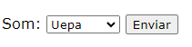
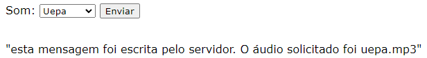

# pythonFlask

## Parte 2 - Entendendo formulários 

Neste exemplo, existem 3 entidades:

* A [página HTML](index.html), que representa nossa **view**;
* O [servidor em Flask](server.py), que representa nosso **controller**;
* [Uma pasta com vários áudios](audios), que representa nosso **model**.

A view possui um [dropdown](https://www.w3schools.com/css/css_selectors.asp) para selecionar qual áudio deve ser requisitado
ao servidor:



Em HTML, esse dropdown é definido da seguinte forma:

```html
<form id="soundboard_form" name="soundboard_form" action="http://localhost:5000/soundboard" method="POST">
    <label for="soundboard_dropdown">Som:</label>
    <select name="soundboard_dropdown" id="soundboard_dropdown">
    <option value="uepa">Uepa</option>
    <option value="rapaz">Rapaaaz</option>
    <option value="ratinho">Ratinho</option>
    <option value="pare">Pare!</option>
    </select>
	<input type="submit">
</form><br/>
```

Repare as informações da tag `form`: o id e o nome do formulário são o mesmo, `soundboard_form`. Quando o botão **Enviar** 
é pressionado, ele envia as informações do formulário (ou seja, o valor selecionado pelo dropdown) para a URL 
http://localhost:5000/soundboard, usando o método POST.

Além disso, também existe um código escrito em Javascript, que usa o formato [AJAX](https://developer.mozilla.org/pt-BR/docs/Web/Guide/AJAX), 
que diz o que deve ser feito quando o servidor envia uma resposta. O código em AJAX está no arquivo [main.js](main.js):

```javascript
$("#soundboard_form").on("submit", function(event){
   event.preventDefault(); // o usuário precisa selecionar um valor diferente do default, senão não envia a requisição

	$.ajax({
		method: "POST",
		url: $(this).attr("action"),
		// envia uma variável soundboard_dropdown para os servidor,
		// pega o valor do soundboard_dropdown do HTML para preencher a variável que vai para o servidor
		data: {soundboard_dropdown: $("#soundboard_dropdown").val()},
		success: function(responseData) {
			// toca o áudio
			console.log(responseData);
			document.getElementById('soundboard_paragraph_result').textContent = JSON.stringify(responseData);
		}
	});
});
```

Existem muitas coisas acontecendo aqui:

* ```$("#soundboard_form").on("submit", function(event)``` significa que estamos criando um evento para quando o botão 
    enviar do formulário `soundboard_form` é pressionado;
* ```$.ajax``` significa que estamos definindo uma ação com AJAX;
* ```method: "POST"``` significa que os dados serão enviados ao servidor usando o método HTTP POST;
* ```url: $(this).attr("action")``` significa que a URL que deve ser acessada quando o botão enviar do formulário 
    `soundboard_form` for pressionado é a URL que está contida no atributo `action`; nós definimos essa URL no HTML:
    ```html
    <form id="soundboard_form" name="soundboard_form" action="http://localhost:5000/soundboard" method="POST">
    ```
* ```data: {audio_solicitado: $("#soundboard_dropdown").val()}``` Essa parte é importante: significa que iremos enviar 
    uma variável de nome `audio_solicitado` para o servidor Flask, que será coletada do lado do servidor usando a sintaxe
    ```request.form['audio_solicitado']```
* ```success: function(responseData)``` diz o que fazer caso a requisição seja bem-sucedida; o servidor envia uma resposta 
    usando a variável `responseData` (é o `return` da parte do servidor), e nós operamos sobre esta resposta usando 
    Javascript (nesse caso, estamos escrevendo no console do navegador, e modificando o texto de um parágrafo que estava 
    oculto na página HTML).

Em resumo: criamos um dropdown para selecionar um áudio a ser enviado pelo servidor, e criamos um protocolo em AJAX para 
tratar a resposta do servidor.

O [código do servidor](server.py), que está na URL ```http://localhost:5000/soundboard```, trata de responder esta 
requisição:

```python
@app.route('/soundboard', methods=['POST'])
def soundboard():
    audio_solicitado = request.form['audio_solicitado']

    response = Response(
        'esta mensagem foi escrita pelo servidor. O áudio solicitado foi %s.mp3' % audio_solicitado
    )
    # adiciona um cabeçalho à resposta
    response.headers.add('Access-Control-Allow-Origin', '*')
    return response
```

Esta parte é mais simples que a anterior: simplesmente pegamos o valor da variável que o AJAX definiu com 
```request.form['audio_solicitado']```, atribuímos ela para uma variável Python, construímos uma resposta com `Response`,
e devolvemos ela para o AJAX com `return`.

Uma vez que o botão submeter do formulário for pressionado, a resposta do servidor aparecerá na página HTML:



Repare que o texto que é escrito no HTML é exatamente o texto que foi devolvido pelo servidor.

Repare também que apenas essa parte da nossa página HTML é modificada; o resto continua inalterado.

É para isso que serve AJAX: para atualizar dinamicamente páginas HTML sem a necessidade de recarregá-las, diminuindo assim 
o custo computacional de adicionar interatividades a sites. 