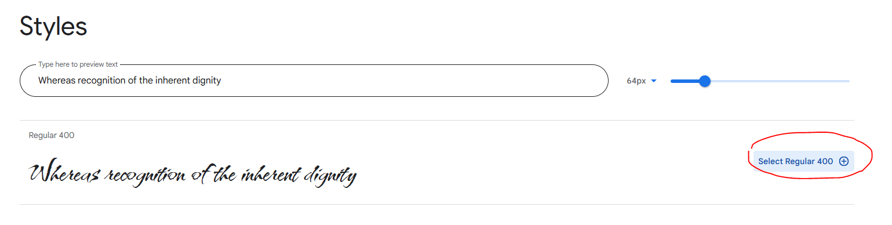
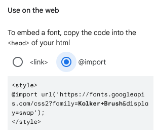
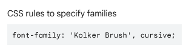

# Como inserir fontes

Se você quiser usar uma fonte customizada (como por exemplo do [Google Fonts](https://fonts.google.com/)), siga o seguinte
passo-a-passo:

1. Ache uma fonte que você gosta. Neste tutorial, usaremos a fonte 
   [Kolker Brush](https://fonts.google.com/specimen/Kolker+Brush) como exemplo.
2. Encontre o estilo da fonte que você deseja usar, e clique no botão `select`:
   
   

3. No menu lateral à direita que se abrir, encontre a seção `Use on the Web`, e selecione a opção `@import`:

   

4. Copie o código fonte e cole no arquivo CSS (se você estiver usando CSS externo), ou dentro das tags `style` (se você
   estiver usando CSS interno ou inline):
   
   ```css
   @import url('https://fonts.googleapis.com/css2?family=Kolker+Brush&display=swap');
   ```

   > Não copie as tags `<style>` se você estiver usando CSS externo!

5. Dentro do arquivo CSS (ou das tags `style`), copie-e-cole a especificação do estilo da fonte que você usará:

   

6. Se tudo der certo, a nova fonte deve aparecer quando você salvar o arquivo e atualizar a página no navegador.
7. Você pode consultar a diferença entre um arquivo [sem fonte](sem_fonte.html) do Google Fonts e outro 
[com fonte](com_fonte.html). O arquivo CSS é definido no arquivo [main.css](main.css).
   * Neste tutorial o CSS está definido externamente. Mas você pode definí-lo 
     [internamente ou inline](https://www.w3schools.com/css/css_howto.asp) também.
